# Complete SwiftUI Reference Guide

Interactive-style reference guide with clear explanations, diagrams, and code examples.

---

# Table of Contents

1. [SwiftUI Mental Model](#swiftui-mental-model)
2. [Property Wrappers](#property-wrappers)
    - [`@State`](#state)
    - [`@Binding`](#binding)
    - [`@StateObject`](#stateobject)
    - [`@ObservedObject`](#observedobject)
    - [`@EnvironmentObject`](#environmentobject)
    - [`@Environment`](#environment)
    - [`@Observable`](#observable)
    - [`@AppStorage`](#appstorage)
    - [`@SceneStorage`](#scenestorage)
    - [Property Wrapper Comparison](#property-wrapper-comparison)
3. [Custom Views](#custom-views)
    - [Basic Custom View](#basic-custom-view)
    - [Custom View With Action](#custom-view-with-action)
4. [Custom Modifiers](#custom-modifiers)
    - [Basic Custom Modifier](#basic-custom-modifier)
    - [Custom Modifier With Parameters](#custom-modifier-with-parameters)
5. [Layout System](#layout-system)
    - [`VStack`](#vstack)
    - [`HStack`](#hstack)
    - [`ZStack`](#zstack)
    - [`LazyVStack`](#lazyvstack)
    - [`LazyVGrid`](#lazyvgrid)
6. [Data Flow](#data-flow)
    - [Parent to Child](#parent-to-child)
    - [Child to Parent](#child-to-parent)
    - [Parent State Modified by Child](#parent-state-modified-by-child)
7. [Animations](#animations)
    - [Implicit Animation](#implicit-animation)
    - [Explicit Animation](#explicit-animation)
    - [Transition](#transition)
8. [Navigation](#navigation)
    - [Basic Navigation](#basic-navigation)
    - [Navigation With Value](#navigation-with-value)
    - [Programmatic Navigation](#programmatic-navigation)
9. [iOS 17/18 New APIs](#ios-1718-new-apis)
    - [`@Observable`](#observable-1)
    - [`NavigationStack`](#navigationstack)
    - [`ContentUnavailableView`](#contentunavailableview)
    - [`sensoryFeedback`](#sensoryfeedback)
    - [`symbolEffect`](#symboleffect)
    - [`scrollPosition`](#scrollposition)
    - [`containerRelativeFrame`](#containerrelativeframe)
    - [`PhaseAnimator`](#phaseanimator)
    - [`KeyframeAnimator`](#keyframeanimator)
10. [Quick Rules](#quick-rules)
11. [Common Interview Explanation](#common-interview-explanation)
12. [Best Practices](#best-practices)
13. [Mini Complete Example](#mini-complete-example)

---

# SwiftUI Mental Model

SwiftUI is declarative.

You do not manually update UI.  
You update state, and SwiftUI updates the UI.

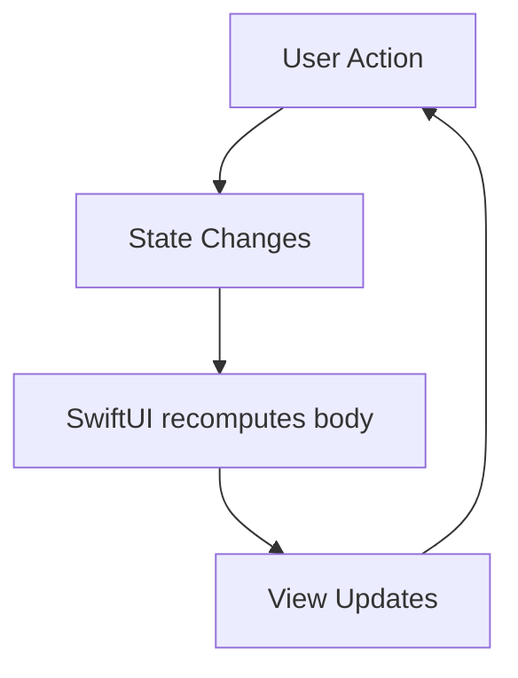

## Simple Memory Rule

```text
State changes -> body recomputes -> UI updates
```

---

# Property Wrappers

SwiftUI uses property wrappers to manage state, data flow, environment values, persistence, and observable models.

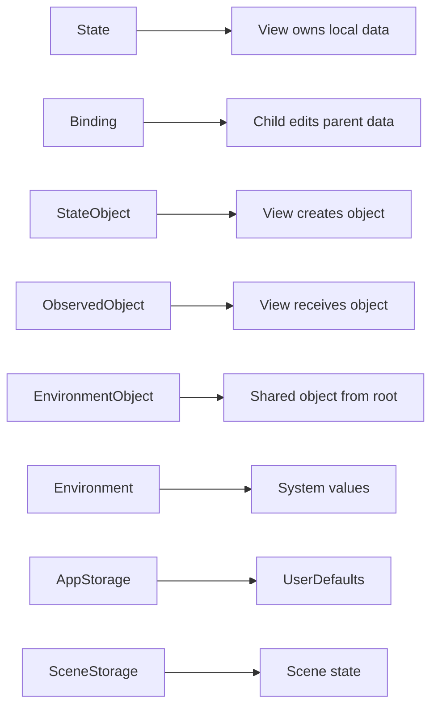

---

## `@State`

### Source of Truth

`@State` is owned by the view.  
When the value changes, SwiftUI re-renders the view.

Use `@State` for simple local value types like:

- `Bool`
- `Int`
- `String`
- `Array`
- `Struct`

### Diagram

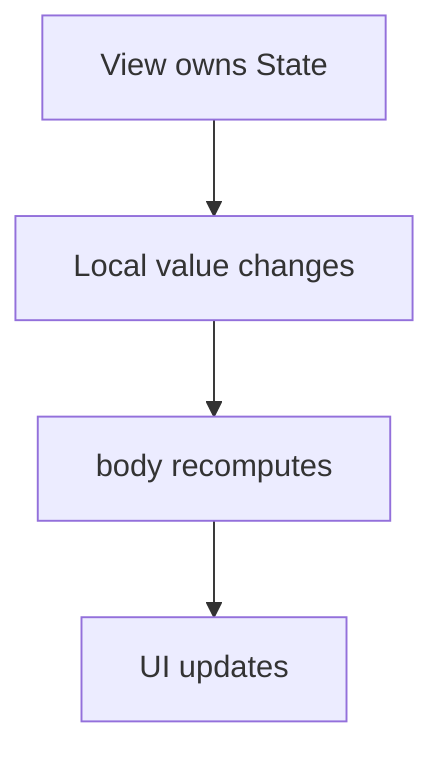

### Example

```swift
import SwiftUI

struct CounterView: View {
    @State private var count: Int = 0

    var body: some View {
        VStack(spacing: 16) {
            Text("Count: \(count)")
                .font(.title)

            Button("Tap") {
                count += 1
            }
        }
        .padding()
    }
}
```

### Notes

Always mark `@State` as `private`.

```swift
@State private var count = 0
```

### Key Points

- Source of truth
- Owned by the view
- Local only
- Value type preferred
- Triggers view re-render

---

## `@Binding`

### Two-Way Connection

`@Binding` is used when a child view needs to read and write state owned by a parent view.

The parent owns the state.  
The child receives a binding using `$`.

### Diagram

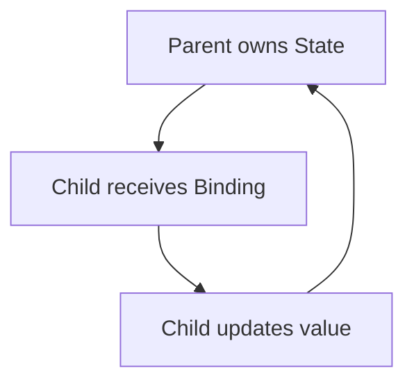

### Child View

```swift
import SwiftUI

struct ToggleRow: View {
    @Binding var isOn: Bool

    var body: some View {
        Toggle("Enable", isOn: $isOn)
            .padding()
    }
}
```

### Parent View

```swift
import SwiftUI

struct SettingsView: View {
    @State private var notificationsEnabled = false

    var body: some View {
        ToggleRow(isOn: $notificationsEnabled)
    }
}
```

### Key Points

- Child view can modify parent state
- Uses `$` prefix
- Two-way sync
- Parent owns the source of truth

---

## `@StateObject`

### Owns an Observable Object

`@StateObject` creates and owns an `ObservableObject`.

Use it when the view is responsible for creating the object.

The object survives SwiftUI view re-renders.

### Diagram

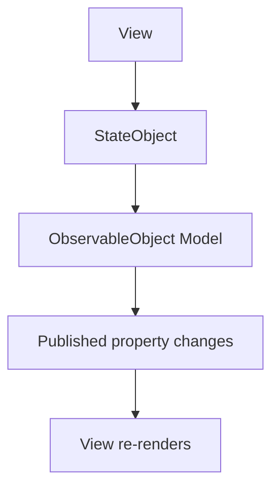

### Model

```swift
import SwiftUI

class TimerModel: ObservableObject {
    @Published var seconds: Int = 0

    func increment() {
        seconds += 1
    }
}
```

### View

```swift
import SwiftUI

struct TimerView: View {
    @StateObject private var model = TimerModel()

    var body: some View {
        VStack(spacing: 16) {
            Text("\(model.seconds)s")
                .font(.largeTitle)

            Button("Add Second") {
                model.increment()
            }
        }
        .padding()
    }
}
```

### Key Points

- Creates object
- Owns object
- Reference type
- Survives view refresh
- Use when the view creates the model

---

## `@ObservedObject`

### Watches an External Object

`@ObservedObject` watches an `ObservableObject` passed from outside.

It does not own the object.

Use it when the parent owns the model and passes it to a child.

### Diagram

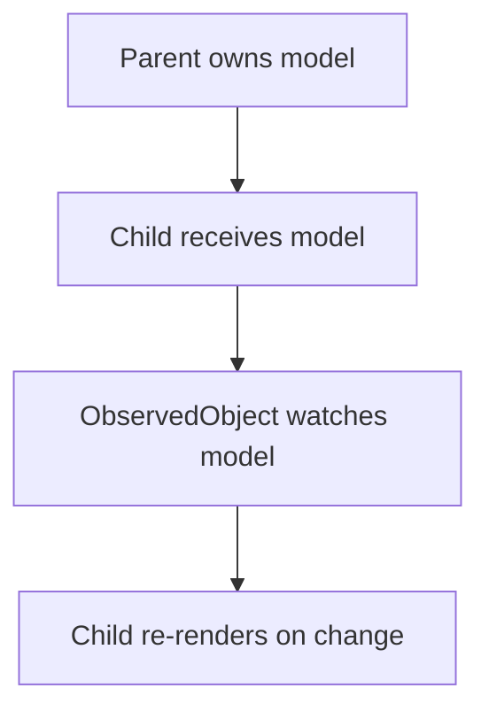

### Child View

```swift
import SwiftUI

struct TimerChildView: View {
    @ObservedObject var model: TimerModel

    var body: some View {
        Text("\(model.seconds)s")
            .font(.title)
    }
}
```

### Parent View

```swift
import SwiftUI

struct TimerParentView: View {
    @StateObject private var model = TimerModel()

    var body: some View {
        VStack(spacing: 16) {
            TimerChildView(model: model)

            Button("Add Second") {
                model.increment()
            }
        }
        .padding()
    }
}
```

### Rule

```swift
@StateObject creates and owns.
@ObservedObject receives and observes.
```

### Key Points

- Injected from outside
- Does not own the object
- Reference type
- Parent controls lifecycle

---

## `@EnvironmentObject`

### Global Shared Object

`@EnvironmentObject` allows shared data to be injected into the SwiftUI view hierarchy.

You do not need to manually pass the object through every screen.

### Diagram

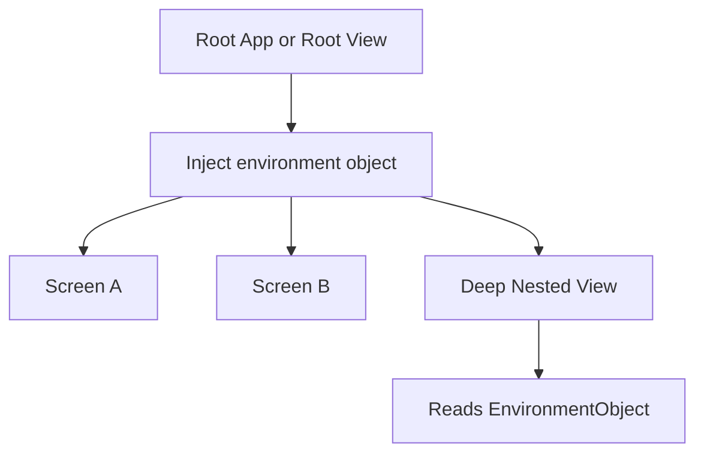

### Model

```swift
import SwiftUI

class UserSettings: ObservableObject {
    @Published var username: String = "Nithin"
    @Published var isPremiumUser: Bool = false
}
```

### Root Injection

```swift
import SwiftUI

@main
struct MyApp: App {
    @StateObject private var settings = UserSettings()

    var body: some Scene {
        WindowGroup {
            ContentView()
                .environmentObject(settings)
        }
    }
}
```

### Child View

```swift
import SwiftUI

struct ProfileView: View {
    @EnvironmentObject var settings: UserSettings

    var body: some View {
        VStack(spacing: 12) {
            Text("User: \(settings.username)")

            Text(settings.isPremiumUser ? "Premium" : "Free")
        }
        .padding()
    }
}
```

### Important

If you forget to inject the object, the app crashes at runtime.

### Preview Example

```swift
#Preview {
    ProfileView()
        .environmentObject(UserSettings())
}
```

### Key Points

- Shared object
- Injected at root
- Available deep in view tree
- Runtime crash if missing

---

## `@Environment`

### System Environment Values

`@Environment` reads values provided by SwiftUI or the system.

Common examples:

- Color scheme
- Locale
- Dismiss action
- Dynamic type size
- Scene phase
- Accessibility settings

### Diagram

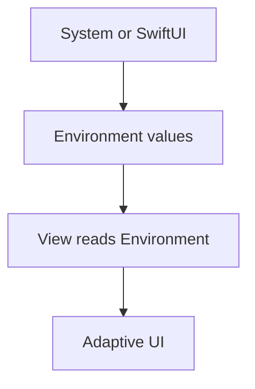

### Example

```swift
import SwiftUI

struct ThemeAwareView: View {
    @Environment(\.colorScheme) private var colorScheme
    @Environment(\.dismiss) private var dismiss
    @Environment(\.locale) private var locale
    @Environment(\.dynamicTypeSize) private var dynamicTypeSize

    var body: some View {
        VStack(spacing: 16) {
            Text("Current scheme: \(colorScheme == .dark ? "Dark" : "Light")")

            Text("Locale: \(locale.identifier)")

            Text("Dynamic Type: \(dynamicTypeSize.description)")

            Button("Dismiss") {
                dismiss()
            }
        }
        .padding()
    }
}
```

### Key Points

- Reads system values
- Usually read-only
- Useful for adaptive UI
- No manual injection needed for built-in values

---

## `@Observable`

### iOS 17+ Observation Macro

`@Observable` is a modern replacement for `ObservableObject`.

It was introduced with Swift 5.9 and iOS 17.

With `@Observable`, you do not need:

```swift
ObservableObject
@Published
@ObservedObject
```

### Diagram

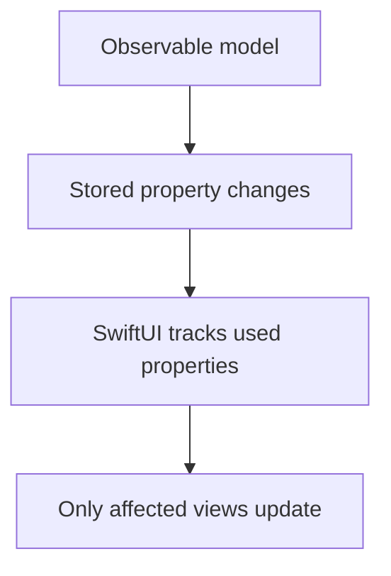

### Model

```swift
import SwiftUI
import Observation

@Observable
class AppModel {
    var username: String = ""
    var score: Int = 0
}
```

### View Owns the Model

Use `@State` when the view owns an `@Observable` object.

```swift
import SwiftUI
import Observation

struct ScoreView: View {
    @State private var model = AppModel()

    var body: some View {
        VStack(spacing: 16) {
            Text("Username: \(model.username)")
            Text("Score: \(model.score)")

            Button("Increase Score") {
                model.score += 1
            }
        }
        .padding()
    }
}
```

### Child Receives the Model

No wrapper is needed when passing the model to a child.

```swift
import SwiftUI
import Observation

struct ScoreChildView: View {
    var model: AppModel

    var body: some View {
        VStack {
            Text("Score: \(model.score)")

            Button("Add") {
                model.score += 1
            }
        }
    }
}
```

### Parent View

```swift
import SwiftUI
import Observation

struct ScoreParentView: View {
    @State private var model = AppModel()

    var body: some View {
        ScoreChildView(model: model)
    }
}
```

### Key Points

- iOS 17+
- Swift 5.9+
- No `@Published`
- No `ObservableObject`
- Use `@State` when view owns the object
- Pass directly to child views

---

## `@AppStorage`

### UserDefaults Persistence

`@AppStorage` stores small values in `UserDefaults`.

Use it for simple app preferences.

Examples:

- Dark mode setting
- Login flag
- Selected language
- Onboarding completed flag

### Diagram

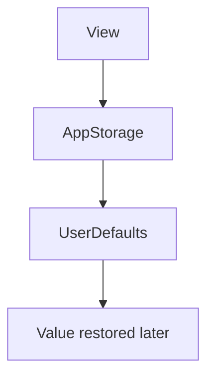

### Example

```swift
import SwiftUI

struct AppStorageExampleView: View {
    @AppStorage("isDarkMode") private var isDarkMode = false

    var body: some View {
        VStack(spacing: 16) {
            Toggle("Dark Mode", isOn: $isDarkMode)

            Text(isDarkMode ? "Dark mode enabled" : "Light mode enabled")
        }
        .padding()
    }
}
```

### Key Points

- Persists to `UserDefaults`
- Good for small settings
- Automatically updates UI
- Not for sensitive data

---

## `@SceneStorage`

### Per-Scene UI State

`@SceneStorage` stores temporary UI state for a specific scene.

Useful for restoring UI state when the app is relaunched.

### Diagram

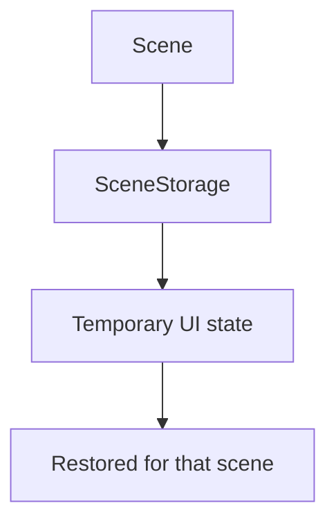

### Example

```swift
import SwiftUI

struct SceneStorageExampleView: View {
    @SceneStorage("selectedTab") private var selectedTab = 0

    var body: some View {
        TabView(selection: $selectedTab) {
            Text("Home")
                .tabItem {
                    Label("Home", systemImage: "house")
                }
                .tag(0)

            Text("Settings")
                .tabItem {
                    Label("Settings", systemImage: "gear")
                }
                .tag(1)
        }
    }
}
```

### Key Points

- Stores per-scene state
- Useful for tab selection
- Restores UI state
- Not for permanent app data

---

# Property Wrapper Comparison

| Wrapper | Owns Data? | Data Type | Use Case |
|---|---:|---|---|
| `@State` | Yes | Value type / local object | Local view state |
| `@Binding` | No | Value from parent | Child modifies parent state |
| `@StateObject` | Yes | `ObservableObject` | View creates model |
| `@ObservedObject` | No | `ObservableObject` | View receives model |
| `@EnvironmentObject` | No | Shared `ObservableObject` | Global shared model |
| `@Environment` | No | System value | Read system values |
| `@Observable` | Depends | Observable class | Modern observation |
| `@AppStorage` | Yes | UserDefaults value | Persist small settings |
| `@SceneStorage` | Yes | Scene value | Restore UI state |

---

# Custom Views

SwiftUI views are structs that conform to `View`.

Use custom views to break large screens into smaller reusable components.

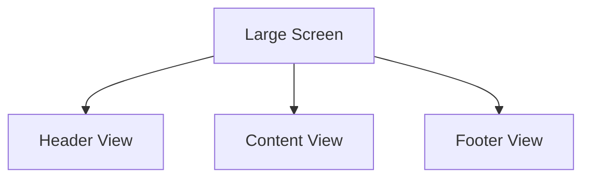

---

## Basic Custom View

```swift
import SwiftUI

struct ProfileCardView: View {
    let name: String
    let role: String

    var body: some View {
        VStack(spacing: 8) {
            Image(systemName: "person.circle.fill")
                .font(.system(size: 48))

            Text(name)
                .font(.headline)

            Text(role)
                .font(.subheadline)
                .foregroundStyle(.secondary)
        }
        .padding()
        .background(.thinMaterial)
        .clipShape(RoundedRectangle(cornerRadius: 16))
    }
}
```

### Usage

```swift
struct ContentView: View {
    var body: some View {
        ProfileCardView(
            name: "Nithin",
            role: "Senior iOS Developer"
        )
        .padding()
    }
}
```

---

## Custom View With Action

```swift
import SwiftUI

struct PrimaryButton: View {
    let title: String
    let action: () -> Void

    var body: some View {
        Button(action: action) {
            Text(title)
                .font(.headline)
                .frame(maxWidth: .infinity)
                .padding()
                .background(.blue)
                .foregroundStyle(.white)
                .clipShape(RoundedRectangle(cornerRadius: 12))
        }
    }
}
```

### Usage

```swift
struct LoginView: View {
    var body: some View {
        PrimaryButton(title: "Login") {
            print("Login tapped")
        }
        .padding()
    }
}
```

---

# Custom Modifiers

Custom modifiers help reuse styling.

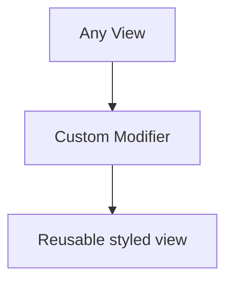

---

## Basic Custom Modifier

```swift
import SwiftUI

struct CardStyleModifier: ViewModifier {
    func body(content: Content) -> some View {
        content
            .padding()
            .background(.background)
            .clipShape(RoundedRectangle(cornerRadius: 16))
            .shadow(radius: 4)
    }
}
```

### Extension

```swift
extension View {
    func cardStyle() -> some View {
        modifier(CardStyleModifier())
    }
}
```

### Usage

```swift
struct CardExampleView: View {
    var body: some View {
        Text("Hello SwiftUI")
            .cardStyle()
            .padding()
    }
}
```

---

## Custom Modifier With Parameters

```swift
import SwiftUI

struct RoundedBorderModifier: ViewModifier {
    let color: Color
    let lineWidth: CGFloat

    func body(content: Content) -> some View {
        content
            .padding()
            .overlay {
                RoundedRectangle(cornerRadius: 12)
                    .stroke(color, lineWidth: lineWidth)
            }
    }
}
```

### Extension

```swift
extension View {
    func roundedBorder(
        color: Color = .blue,
        lineWidth: CGFloat = 1
    ) -> some View {
        modifier(
            RoundedBorderModifier(
                color: color,
                lineWidth: lineWidth
            )
        )
    }
}
```

### Usage

```swift
struct BorderExampleView: View {
    var body: some View {
        Text("Bordered Text")
            .roundedBorder(color: .green, lineWidth: 2)
            .padding()
    }
}
```

---

# Layout System

SwiftUI layout is declarative.

Common layout containers:

- `VStack`
- `HStack`
- `ZStack`
- `Grid`
- `LazyVStack`
- `LazyHStack`
- `LazyVGrid`
- `LazyHGrid`

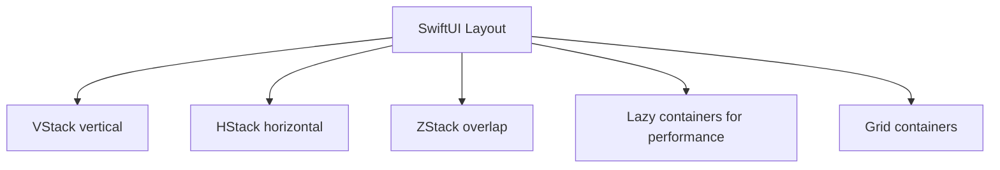

---

## `VStack`

Vertical layout.

```swift
import SwiftUI

struct VStackExample: View {
    var body: some View {
        VStack(spacing: 16) {
            Text("Title")
                .font(.title)

            Text("Subtitle")
                .foregroundStyle(.secondary)

            Button("Continue") {
                print("Continue tapped")
            }
        }
        .padding()
    }
}
```

---

## `HStack`

Horizontal layout.

```swift
import SwiftUI

struct HStackExample: View {
    var body: some View {
        HStack(spacing: 12) {
            Image(systemName: "star.fill")
                .foregroundStyle(.yellow)

            Text("Favorite")

            Spacer()

            Image(systemName: "chevron.right")
        }
        .padding()
    }
}
```

---

## `ZStack`

Overlapping layout.

```swift
import SwiftUI

struct ZStackExample: View {
    var body: some View {
        ZStack {
            RoundedRectangle(cornerRadius: 20)
                .fill(.blue.gradient)
                .frame(height: 160)

            Text("Overlay Text")
                .font(.title)
                .foregroundStyle(.white)
        }
        .padding()
    }
}
```

---

## `LazyVStack`

Efficient vertical list rendering.

```swift
import SwiftUI

struct LazyVStackExample: View {
    let items = Array(1...1000)

    var body: some View {
        ScrollView {
            LazyVStack(alignment: .leading, spacing: 12) {
                ForEach(items, id: \.self) { item in
                    Text("Item \(item)")
                        .padding()
                        .frame(maxWidth: .infinity, alignment: .leading)
                        .background(.gray.opacity(0.15))
                        .clipShape(RoundedRectangle(cornerRadius: 8))
                }
            }
            .padding()
        }
    }
}
```

---

## `LazyVGrid`

Grid layout.

```swift
import SwiftUI

struct LazyVGridExample: View {
    let columns = [
        GridItem(.flexible()),
        GridItem(.flexible())
    ]

    let items = Array(1...20)

    var body: some View {
        ScrollView {
            LazyVGrid(columns: columns, spacing: 16) {
                ForEach(items, id: \.self) { item in
                    Text("Card \(item)")
                        .frame(maxWidth: .infinity)
                        .frame(height: 100)
                        .background(.blue.opacity(0.2))
                        .clipShape(RoundedRectangle(cornerRadius: 12))
                }
            }
            .padding()
        }
    }
}
```

---

# Data Flow

SwiftUI data flow is based on ownership.

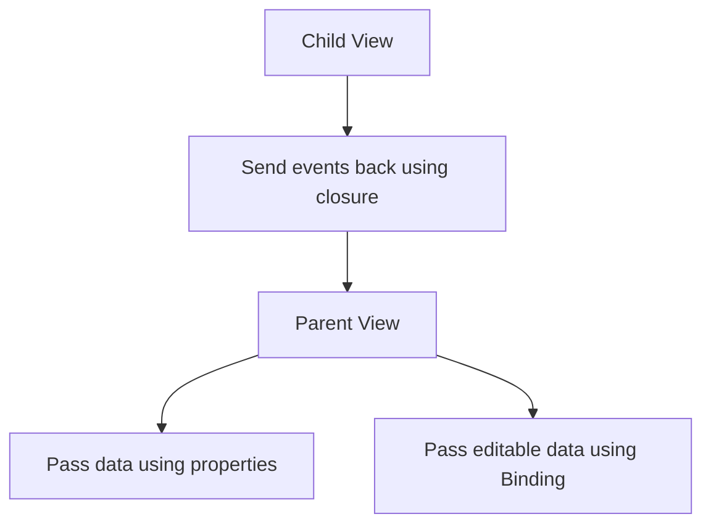

---

## Parent to Child

Use normal properties.

```swift
import SwiftUI

struct GreetingView: View {
    let name: String

    var body: some View {
        Text("Hello, \(name)")
    }
}

struct ParentView: View {
    var body: some View {
        GreetingView(name: "Nithin")
    }
}
```

---

## Child to Parent

Use closures.

```swift
import SwiftUI

struct ActionChildView: View {
    let onTap: () -> Void

    var body: some View {
        Button("Tap Child") {
            onTap()
        }
    }
}

struct ActionParentView: View {
    var body: some View {
        ActionChildView {
            print("Child tapped")
        }
    }
}
```

---

## Parent State Modified by Child

Use `@Binding`.

```swift
import SwiftUI

struct NameEditorView: View {
    @Binding var name: String

    var body: some View {
        TextField("Enter name", text: $name)
            .textFieldStyle(.roundedBorder)
            .padding()
    }
}

struct NameParentView: View {
    @State private var name = ""

    var body: some View {
        VStack(spacing: 16) {
            NameEditorView(name: $name)

            Text("Name: \(name)")
        }
        .padding()
    }
}
```

---

# Animations

SwiftUI supports implicit and explicit animations.

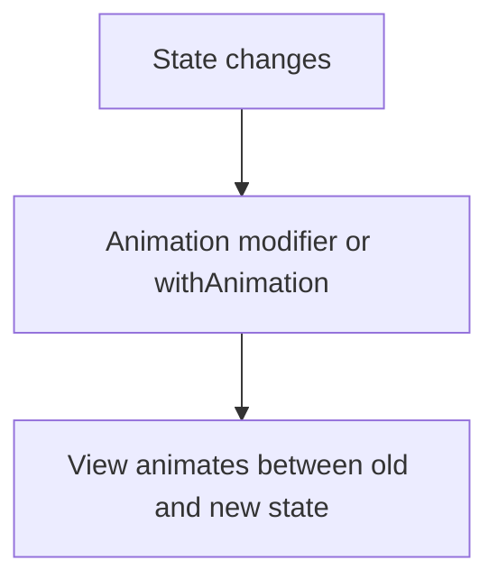

---

## Implicit Animation

```swift
import SwiftUI

struct ImplicitAnimationView: View {
    @State private var isExpanded = false

    var body: some View {
        VStack(spacing: 16) {
            RoundedRectangle(cornerRadius: 20)
                .fill(.blue)
                .frame(
                    width: isExpanded ? 240 : 120,
                    height: isExpanded ? 240 : 120
                )
                .animation(.spring, value: isExpanded)

            Button("Toggle") {
                isExpanded.toggle()
            }
        }
        .padding()
    }
}
```

---

## Explicit Animation

```swift
import SwiftUI

struct ExplicitAnimationView: View {
    @State private var isExpanded = false

    var body: some View {
        VStack(spacing: 16) {
            RoundedRectangle(cornerRadius: 20)
                .fill(.green)
                .frame(
                    width: isExpanded ? 240 : 120,
                    height: isExpanded ? 240 : 120
                )

            Button("Animate") {
                withAnimation(.easeInOut(duration: 0.4)) {
                    isExpanded.toggle()
                }
            }
        }
        .padding()
    }
}
```

---

## Transition

```swift
import SwiftUI

struct TransitionExampleView: View {
    @State private var showMessage = false

    var body: some View {
        VStack(spacing: 16) {
            if showMessage {
                Text("Hello SwiftUI")
                    .padding()
                    .background(.blue.opacity(0.2))
                    .clipShape(RoundedRectangle(cornerRadius: 12))
                    .transition(.scale.combined(with: .opacity))
            }

            Button("Toggle") {
                withAnimation {
                    showMessage.toggle()
                }
            }
        }
        .padding()
    }
}
```

---

# Navigation

Use `NavigationStack` for modern SwiftUI navigation.

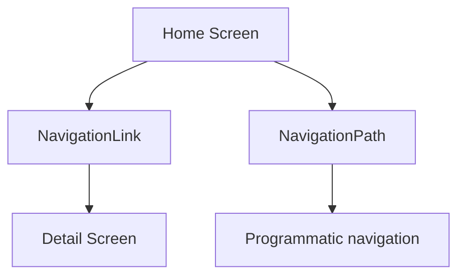

---

## Basic Navigation

```swift
import SwiftUI

struct HomeView: View {
    var body: some View {
        NavigationStack {
            List {
                NavigationLink("Go to Details") {
                    DetailView()
                }
            }
            .navigationTitle("Home")
        }
    }
}

struct DetailView: View {
    var body: some View {
        Text("Detail Screen")
            .navigationTitle("Details")
    }
}
```

---

## Navigation With Value

```swift
import SwiftUI

struct Book: Identifiable, Hashable {
    let id = UUID()
    let title: String
}

struct BookListView: View {
    let books = [
        Book(title: "SwiftUI Basics"),
        Book(title: "Advanced SwiftUI"),
        Book(title: "iOS Architecture")
    ]

    var body: some View {
        NavigationStack {
            List(books) { book in
                NavigationLink(value: book) {
                    Text(book.title)
                }
            }
            .navigationTitle("Books")
            .navigationDestination(for: Book.self) { book in
                BookDetailView(book: book)
            }
        }
    }
}

struct BookDetailView: View {
    let book: Book

    var body: some View {
        Text(book.title)
            .font(.title)
            .navigationTitle("Book Detail")
    }
}
```

---

## Programmatic Navigation

```swift
import SwiftUI

struct ProgrammaticNavigationView: View {
    @State private var path = NavigationPath()

    var body: some View {
        NavigationStack(path: $path) {
            VStack(spacing: 16) {
                Button("Go to Profile") {
                    path.append("profile")
                }

                Button("Go to Settings") {
                    path.append("settings")
                }
            }
            .navigationTitle("Home")
            .navigationDestination(for: String.self) { route in
                if route == "profile" {
                    Text("Profile Screen")
                } else if route == "settings" {
                    Text("Settings Screen")
                }
            }
        }
    }
}
```

---

# iOS 17/18 New APIs

Modern SwiftUI APIs improve observation, navigation, animations, empty states, scrolling, and feedback.

---

## `@Observable`

Modern observation system.

```swift
import SwiftUI
import Observation

@Observable
class UserModel {
    var name = "Nithin"
    var age = 30
}

struct ObservableExampleView: View {
    @State private var user = UserModel()

    var body: some View {
        VStack(spacing: 16) {
            Text(user.name)

            Button("Change Name") {
                user.name = "SwiftUI Developer"
            }
        }
        .padding()
    }
}
```

---

## `NavigationStack`

Modern replacement for `NavigationView`.

```swift
import SwiftUI

struct ModernNavigationExample: View {
    var body: some View {
        NavigationStack {
            List {
                NavigationLink("Open Details") {
                    Text("Details")
                }
            }
            .navigationTitle("Modern Navigation")
        }
    }
}
```

---

## `ContentUnavailableView`

Useful for empty states.

```swift
import SwiftUI

struct EmptyStateView: View {
    var body: some View {
        ContentUnavailableView(
            "No Results",
            systemImage: "magnifyingglass",
            description: Text("Try searching with another keyword.")
        )
    }
}
```

---

## `sensoryFeedback`

Haptic feedback in SwiftUI.

```swift
import SwiftUI

struct SensoryFeedbackExample: View {
    @State private var trigger = false

    var body: some View {
        Button("Tap for Feedback") {
            trigger.toggle()
        }
        .sensoryFeedback(.success, trigger: trigger)
    }
}
```

---

## `symbolEffect`

Animate SF Symbols.

```swift
import SwiftUI

struct SymbolEffectExample: View {
    @State private var isActive = false

    var body: some View {
        VStack(spacing: 16) {
            Image(systemName: "heart.fill")
                .font(.system(size: 64))
                .foregroundStyle(.red)
                .symbolEffect(.bounce, value: isActive)

            Button("Animate") {
                isActive.toggle()
            }
        }
        .padding()
    }
}
```

---

## `scrollPosition`

Track or control scroll position.

```swift
import SwiftUI

struct ScrollPositionExample: View {
    @State private var scrollID: Int?

    var body: some View {
        VStack {
            Button("Go to Item 50") {
                scrollID = 50
            }

            ScrollView {
                LazyVStack {
                    ForEach(1...100, id: \.self) { item in
                        Text("Item \(item)")
                            .id(item)
                            .padding()
                    }
                }
                .scrollTargetLayout()
            }
            .scrollPosition(id: $scrollID)
        }
    }
}
```

---

## `containerRelativeFrame`

Size views relative to their container.

```swift
import SwiftUI

struct ContainerRelativeFrameExample: View {
    var body: some View {
        ScrollView(.horizontal) {
            HStack {
                ForEach(1...5, id: \.self) { item in
                    RoundedRectangle(cornerRadius: 20)
                        .fill(.blue.gradient)
                        .containerRelativeFrame(.horizontal)
                        .overlay {
                            Text("Page \(item)")
                                .font(.title)
                                .foregroundStyle(.white)
                        }
                }
            }
            .scrollTargetLayout()
        }
        .scrollTargetBehavior(.paging)
    }
}
```

---

## `PhaseAnimator`

Animate through multiple phases.

```swift
import SwiftUI

struct PhaseAnimatorExample: View {
    var body: some View {
        PhaseAnimator([0.8, 1.2, 1.0]) { phase in
            Image(systemName: "star.fill")
                .font(.system(size: 80))
                .scaleEffect(phase)
                .foregroundStyle(.yellow)
        } animation: { phase in
            .spring(duration: 0.4)
        }
    }
}
```

---

## `KeyframeAnimator`

Create more controlled animations.

```swift
import SwiftUI

struct KeyframeAnimatorExample: View {
    var body: some View {
        KeyframeAnimator(
            initialValue: AnimationValues()
        ) { values in
            Image(systemName: "paperplane.fill")
                .font(.system(size: 64))
                .offset(x: values.x, y: values.y)
                .rotationEffect(.degrees(values.rotation))
        } keyframes: { _ in
            KeyframeTrack(\.x) {
                LinearKeyframe(100, duration: 0.4)
                LinearKeyframe(0, duration: 0.4)
            }

            KeyframeTrack(\.y) {
                LinearKeyframe(-80, duration: 0.4)
                LinearKeyframe(0, duration: 0.4)
            }

            KeyframeTrack(\.rotation) {
                LinearKeyframe(30, duration: 0.4)
                LinearKeyframe(0, duration: 0.4)
            }
        }
    }
}

struct AnimationValues {
    var x: CGFloat = 0
    var y: CGFloat = 0
    var rotation: Double = 0
}
```

---

# Quick Rules

## State Ownership

| Use This | When |
|---|---|
| `@State` | View owns simple local state |
| `@Binding` | Child modifies parent state |
| `@StateObject` | View creates and owns an `ObservableObject` |
| `@ObservedObject` | View receives an `ObservableObject` |
| `@EnvironmentObject` | Many screens need the same shared object |
| `@Environment` | View reads system-provided values |
| `@Observable` | Modern iOS 17+ observable models |
| `@AppStorage` | Persist small values in `UserDefaults` |
| `@SceneStorage` | Restore temporary scene UI state |

---

## Memory Shortcut

```text
State owns.
Binding borrows.
StateObject creates.
ObservedObject receives.
EnvironmentObject shares.
Environment reads.
AppStorage persists.
SceneStorage restores.
Observable modernizes.
```

---

# Common Interview Explanation

SwiftUI is a declarative UI framework.

Instead of manually updating UI, we update state.  
SwiftUI observes that state and re-renders the affected views.

Example:

```swift
@State private var count = 0
```

When `count` changes, SwiftUI recomputes the `body`.

```swift
Button("Tap") {
    count += 1
}
```

The UI updates automatically.

---

# Best Practices

- Keep views small.
- Use `@State` for local state.
- Use `@Binding` for child-to-parent updates.
- Use `@StateObject` when creating view models.
- Use `@ObservedObject` when receiving view models.
- Use `@EnvironmentObject` carefully because missing injection causes runtime crashes.
- Prefer `@Observable` for iOS 17+ projects.
- Extract repeated UI into custom views.
- Extract repeated styling into custom modifiers.
- Use `NavigationStack`, not old `NavigationView`.
- Use lazy containers for large lists.
- Keep business logic outside views when possible.

---

# Mini Complete Example

```swift
import SwiftUI
import Observation

@Observable
class TodoStore {
    var tasks: [TodoTask] = []

    func addTask(title: String) {
        let task = TodoTask(title: title, isCompleted: false)
        tasks.append(task)
    }

    func toggleTask(_ task: TodoTask) {
        guard let index = tasks.firstIndex(where: { $0.id == task.id }) else {
            return
        }

        tasks[index].isCompleted.toggle()
    }
}

struct TodoTask: Identifiable, Hashable {
    let id = UUID()
    var title: String
    var isCompleted: Bool
}

struct TodoListView: View {
    @State private var store = TodoStore()
    @State private var title = ""

    var body: some View {
        NavigationStack {
            VStack(spacing: 16) {
                HStack {
                    TextField("Enter task", text: $title)
                        .textFieldStyle(.roundedBorder)

                    Button("Add") {
                        guard !title.isEmpty else {
                            return
                        }

                        store.addTask(title: title)
                        title = ""
                    }
                }
                .padding(.horizontal)

                List {
                    ForEach(store.tasks) { task in
                        TodoRowView(task: task) {
                            store.toggleTask(task)
                        }
                    }
                }
            }
            .navigationTitle("Todos")
        }
    }
}

struct TodoRowView: View {
    let task: TodoTask
    let onToggle: () -> Void

    var body: some View {
        Button(action: onToggle) {
            HStack {
                Image(systemName: task.isCompleted ? "checkmark.circle.fill" : "circle")

                Text(task.title)
                    .strikethrough(task.isCompleted)

                Spacer()
            }
        }
        .buttonStyle(.plain)
    }
}

#Preview {
    TodoListView()
}
```

---

# End

This guide covers the most important SwiftUI concepts with working code examples, diagrams, and memory shortcuts.
